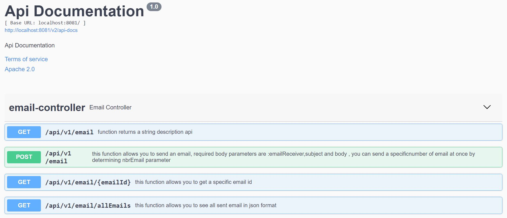
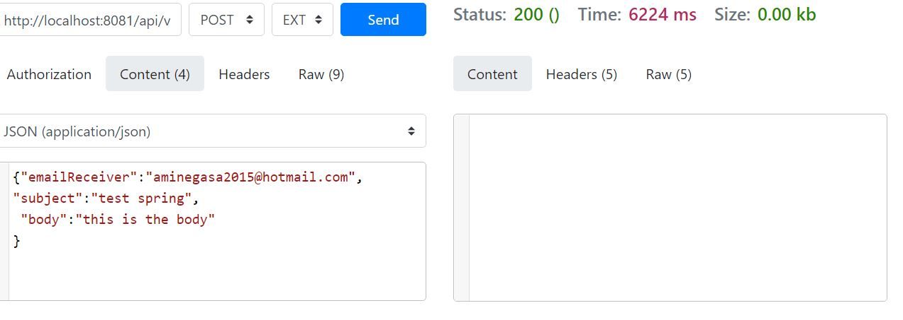
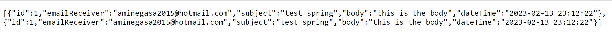

# Email-Spring-Boot-Java-Using-REST-API-and-Swagger-Documentation

 spring boot java project which allows you to send an email using REST API , i also document this API with Swagger tool.

body POST REQUEST:

{"emailReceiver":"email address receiver",
"subject":"test spring",
 "body":"this is the body"
}
# Screenshot
####  swagger tool documentation

#### body post request to send an email

